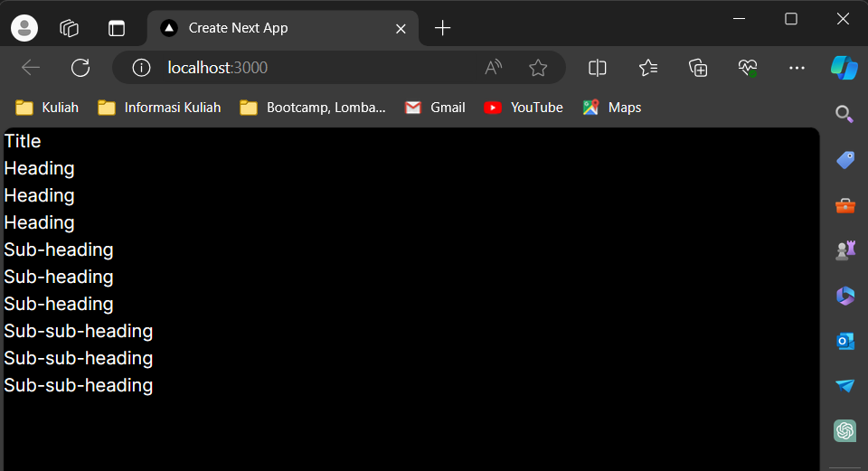

# **Laporan Praktikum Pertemuan 07: Belajar Context**
## **Mata Kuliah Pemrograman Berbasis Framework 2023 Semester Genap**

| **Dosen Pembina** | Habibie Ed Dien, S.Kom., M.T. |
|--|-----|

| **Nama** | Alya Marliza Koesnanto |
|--|-----|
| **No. Absen/NIM** | 03 - 2141720004 |
| **Kelas** | TI-3A |

### **Praktikum 1: Membuat Variasi Ukuran Teks Heading dengan Context**

* **Soal 1**
> **Hasil Laporan Soal 1**

**Penjelasan:** Pada gambar diatas kita mempelajari struktur dengan menggunakan prinsip atomic design.
>
> Prinsip atomic design sendiri mengacu pada atom yang dimana atom merupakan molekul atau partikel yang bercabang-cabang dari molekul paling besar hingga terkecil. Pada atomic design sendiri terdapat berbagai struktur folder seperti atoms, molecules, organisms, dan templates. 
>
> Disini saya mempelajari bagaimana prinsip atomic design bekerja, kurang lebihnya prinsip ini bisa disamakan dengan menu yang berada pada Ms. Word yang dimana terdapat menu Styles yang dapat mengatur Heading serta Sub-Heading pada suatu _file_.

